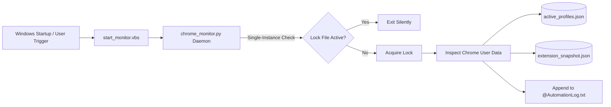

# 🔍 Chrome Monitor

<div align="center">

[](LICENSE)
[](https://github.com/Kamran5H/ChromeMonitor)
[](https://github.com/Kamran5H/ChromeMonitor)
[](https://github.com/Kamran5H/ChromeMonitor)
[](https://github.com/Kamran5H/ChromeMonitor)

**A lightweight, single-instance Windows background utility that audits active Google Chrome profiles, installed extensions, and process lifecycles.**

[Features](#-key-features) • [Installation](#-installation--service-setup) • [Architecture](#-architecture) • [Files](#-repository-structure) • [License](#-license)

</div>

---

## 🌟 Executive Overview

**Chrome Monitor** is a dedicated Windows system administration and security monitoring utility written in Python. It watches the local Google Chrome user data directory (`%LOCALAPPDATA%\Google\Chrome\User Data`), tracks which browser profiles are concurrently active, monitors extensions installed or loaded into each profile, and maintains an auditable timeline log.

Engineered for stability, Chrome Monitor utilizes Windows inter-process lock files to strictly prevent duplicate instances, provides silent `.vbs` background execution, and ships with turnkey startup registration scripts.

---

## 🚀 Key Features

- **👥 Multi-Profile Tracking**: Scans and parses `Local State` and profile directories (`Default`, `Profile 1`, etc.) to detect active user sessions.
- **🧩 Extension Inventory & Change Detection**: Generates structured snapshots (`extension_snapshot.json`) of all installed extensions, IDs, version numbers, and permissions, flagging unexpected additions.
- **🔒 Single-Instance Guarantee**: Implements robust Windows file-locking primitives so only one daemon process runs at any given time.
- **🔕 Silent Background Operation**: Lauched via `start_monitor.vbs` without opening an intrusive command prompt console.
- **📝 Comprehensive Automation Logging**: Maintains timestamped records in `@AutomationLog.txt` tracking launch events, profile switches, and shutdown hooks.
- **⚡ Startup Automation**: Turnkey `.bat` scripts to install or remove the monitor from the Windows user startup registry or folder.

---

## 🏗️ Architecture



---

## 📁 Repository Structure

```text
ChromeMonitor/
├── chrome_monitor.py           # Core monitoring daemon & profile inspection engine
├── active_profiles.json        # Live serialized state of currently active profiles
├── extension_snapshot.json     # Comprehensive catalog of installed extensions & versions
├── @AutomationLog.txt          # Continuous system audit log
├── start_monitor.vbs           # Silent VBScript background launcher
├── install_startup.bat         # Turnkey batch script to register Windows startup
├── stop_monitor.bat            # Graceful process terminator script
├── .gitignore                  # Python & Windows runtime exclusions
└── LICENSE                     # Open-source MIT License
```

---

## ⚡ Installation & Service Setup

### 1. Manual Launch
```bash
# Run in terminal
python chrome_monitor.py

# Or launch silently in background
start_monitor.vbs
```

### 2. Auto-Start with Windows
1. Double-click [`install_startup.bat`](install_startup.bat) to place a launcher shortcut in your Windows Startup directory (`shell:startup`).
2. Chrome Monitor will now quietly initialize every time you log into Windows.

### 3. Stop Monitor
Double-click [`stop_monitor.bat`](stop_monitor.bat) to release the lock and terminate the running monitor process.

---

## 📜 License

This project is open-source and released under the [MIT License](LICENSE).  
Copyright (c) 2024-2026 **Kamran Ashraf**.
